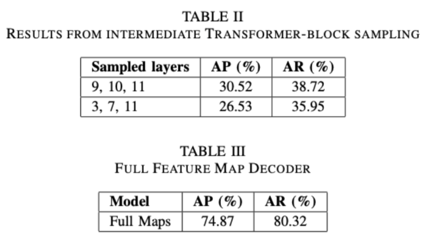
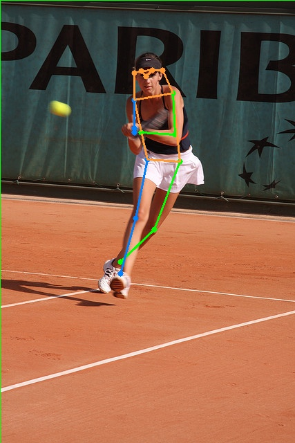

# Refining ViTPose: Enhancing Human Pose Estimation and Future Motion Prediction with Feature Pyramids and Transformers
{: .fs-9 }

ROB 499/599 Deep Learning for Robot Perception

Niva Ranavat, Sarah Jamil, Adithya Raman, Jacob Klinger

[Vitpose Documentation][vitpose]{: .btn .btn-primary .fs-5 .mb-4 .mb-md-0 .mr-2 }

[View VitPose FPN on GitHub][vitpose extension repo]{: .btn .fs-5 .mb-4 .mb-md-0 }
[View VitPose Pose Prediction on GitHub][vitpose pose prediction]{: .btn .fs-5 .mb-4 .mb-md-0 }

---

We conducted an ablation study on the original ViTPose architecture by fine-tuning it to incorporate a Feature Pyramid Network (FPN), aiming to enhance the accuracy of Human Pose Estimation. One limitation of the original ViTPose is its tendency to overlook fine-grained details and smaller features, particularly in scenes where objects are close together or overlapping. By integrating FPN, we aim to address this issue by improving multi-scale feature representation.
In addition to this, we extended ViTPose by designing a secondary pose prediction network. In this framework, ViTPose is first used as a feature extractor on sequences of video frames, and a lightweight transformer model is then trained to predict the future poses across multiple frames. This extension allowed us to explore not just static pose estimation, but the task of forecasting human motion over time based on visual input.

---
## Background

Human pose estimation is a fundamental task in computer vision with applications in activity recognition, animation, and human-computer interaction. Recent approaches like ViTPose leverage Vision Transformers to capture long-range dependencies and achieve impressive results. However, pure transformer-based models often lack multi-scale spatial detail critical for precise keypoint localization. To address this, we enhance ViTPose by incorporating a Feature Pyramid Network (FPN) and an encoder-decoder structure, enabling richer spatial representations and refined heatmap predictions for improved pose estimation accuracy. As a stretch goal, we explore extending the model to predict future human poses from observed sequences to enable motion forecasting.

The original ViTPose model applies Vision Transformers (ViTs) to the task of human pose estimation by treating each image as a sequence of patches and processing them through self-attention layers to capture long-range spatial dependencies. Unlike traditional convolution-based methods, ViTPose leverages global context to accurately predict keypoints, achieving state-of-the-art results on benchmarks like COCO and MPII. It uses a simple yet effective backbone and a linear head to directly regress heatmaps for each keypoint, demonstrating that transformer-based models can excel in dense prediction tasks when properly adapted.

Predicting future human poses extends traditional pose estimation into the temporal domain, aiming to model and forecast human motion dynamics. This task requires learning not only spatial configurations of the body but also how these configurations evolve over time. Approaches for pose prediction typically involve sequence modeling techniques such as recurrent neural networks, temporal convolutions, or transformers. Accurate future pose forecasting has important applications in action anticipation, autonomous systems, and augmented reality, where understanding human motion trajectories is critical.

--- 
## Dataset
We used the MS COCO dataset. The MS COCO dataset for human pose estimation provides images with rich annotations of keypoints for multiple people, including 17 body joints such as elbows, knees, and ankles. It was used in the original ViTPose and is also  widely used as a benchmark for evaluating human pose estimation models due to its diverse and challenging real-world scenes.

For motion forecasting experiments, we utilized the 3D Poses in the Wild (3DPW) dataset. The 3DPW dataset contains real-world video sequences with accurate 3D and 2D pose annotations, captured from wearable IMUs and synchronized camera footage, making it valuable for studying human motion over time.

[View the COCO dataset][coco dataset]{: .btn .btn-primary .fs-5 .mb-4 .mb-md-0 .mr-2 }
[View the 3DPW dataset][3d poses in the wild]{: .btn .btn-primary .fs-5 .mb-4 .mb-md-0 .mr-2 }

---
## Network Architecture and Setup

### Original VitPose:

Inputs:
- RGB Images:
  - Standard 2D images, typically from datasets like COCO or MPII
  - Resized and normalized to match model requirements
-  2D Keypoint Annotations (during training):
  - Supervised keypoint labels for calculating heatmap-based loss

Modules:
- Patch Embedding Module:
  - Divides the input image into fixed-size patches and flattens them
  - Projects patch vectors into a consistent embedding space
- Vision Transformer Encoder:
  - Applies multi-head self-attention to model global dependencies across all patches
  - Includes positional embeddings and a learnable class token
- Pose Prediction Head:
  - A lightweight convolutional or linear layer that converts encoded features into heatmaps
  - One heatmap per keypoint

Outputs:
- 2D Keypoint Heatmaps:
  - Predicted probability maps indicating the location of each joint
  - Output shape typically (N, num_keypoints, H, W)
- Keypoint Coordinates (post-processing):
  - Extracted joint locations from heatmaps via argmax or soft-argmax
  - Used for evaluation metrics such as PCK (Percentage of Correct Keypoints)

### Proposed Change for FPN Extension:

Inputs:
- COCO 2017 Subset Loader:
  - Custom loader using a reduced version of the COCO 2017 dataset.
  - Provides images and 2D human pose annotations (keypoints) for training and evaluation.

Modules:
- ViTPose Backbone (Frozen):
  - Pretrained ViTPose-B model used as a fixed feature extractor.
  - Outputs intermediate features after each transformer block for FPN construction.
- Feature Pyramid Network (FPN) Neck:
  - Builds multi-scale feature maps from selected transformer outputs.
  - Uses 1x1 convolutions and bilinear upsampling to align feature sizes.
  - Adds top-down skip connections to fuse spatial and semantic information.
- Modified Pose Estimation Decoder:
  - Upsamples and concatenates FPN features.
  - Predicts 2D keypoint heatmaps from the refined multi-scale features.
  - Maintains a lightweight architecture for efficient decoding.

Outputs:
- 2D Human Keypoint Heatmaps:
  - Refined spatial probability maps for 17 human joints.
  - Improved resolution and small joint prediction compared to the baseline.
- Keypoint Coordinate Predictions (Post-Processing):
  - Joint locations extracted from heatmaps.
  - Used for quantitative evaluation with COCO metrics (AP, AR).

### Proposed Change for Pose Predictions Extension:

Example of frame images from the 3D Poses in the Wild dataset

Inputs:
- 2D Keypoint Sequences:
  - Normalized 2D keypoints extracted from RGB images using ViTPose
  - Represented as sequences of 10 frames (input window)

Modules:
- Input Projection Layer:
  - Applies a linear transformation to project each 2D keypoint vector into a hidden feature space
  - Enables compatibility with transformer input expectations
- Transformer Encoder:
  - Models temporal dependencies across the sequence of frames
  - Uses multi-head self-attention to capture how poses evolve over time
- Pose Prediction Decoder:
  - A linear layer that maps encoded features back into predicted 2D keypoint coordinates
  - Predicts multiple future frames (typically 5)

Outputs:
- Predicted 2D Keypoint Sequences:
  - 5 frames of predicted future keypoints
  - Each frame output is a set of (x, y) coordinates for each joint

---
## Results

### Feature Pyramid Network

Using the provided ViTPose-B weights, we were able to successfully reproduce the results of the paper, confirming an AP of 75.8 and an AR 81.1

From our experimentation of using intermediate feature outputs from the transformer backbone, we produced the results in Table 
Table II, as seen above. The two models sampled outputs for the FPN at various locations along the backbone, which included us trying to evenly space out the sampling and back load the sampling. Each model was trained using the frozen backbone weights of the base ViTPose model over 30 epochs on one tenth of the COCO dataset. Here we noticed that the use of intermediate layers to create our feature pyramid dramatically deceased model performance compared to the base model. However, by using intermediate features from transformer blocks closer to the end of the backbone, there was a slight increase in performance compared to the evenly spaced sampling.

Finally, during our testing that used all of the feature maps which were produced from the last transformer block output, we found that the dense stride scheme produced the best results. Table III displays these results. This approach leveraged four different feature maps which were obtained using strides: 1, 2, 4, 8. All of these feature maps were passed into the decoder which up sampled them to the resolution of the largest map and concatenated them along the channel dimension. The results shown were obtained by training for a duration of 30 epochs over one tenth of the COCO dataset. Using this model, we also produced the results shown below.

### Future Pose Prediction

Examples of predicted keypoints from the extended Vitpose Predictor:

The results of our pose prediction experiments showed that while the model was able to capture general trends in motion, its quantitative accuracy was relatively low. Using a 50-pixel threshold for correctness, the average accuracy across the five predicted frames hovered around 25%, with the first predicted frame typically achieving slightly higher accuracy than later frames. Qualitatively, many predicted poses visually resembled the ground-truth poses, although they often missed precise joint locations. These results reflect the difficulty of long-term motion prediction from limited input data and 2D-only pose information.

---

[vitpose extension repo]: https://github.com/klingjac/ViTPoseFPN
[vitpose pose prediction]: https://github.com/Sarahtj/Vitpose_Pose_Prediction
[vitpose]: https://arxiv.org/abs/2204.12484
[coco dataset]: https://cocodataset.org/#home
[3d poses in the wild]: https://virtualhumans.mpi-inf.mpg.de/3DPW/
